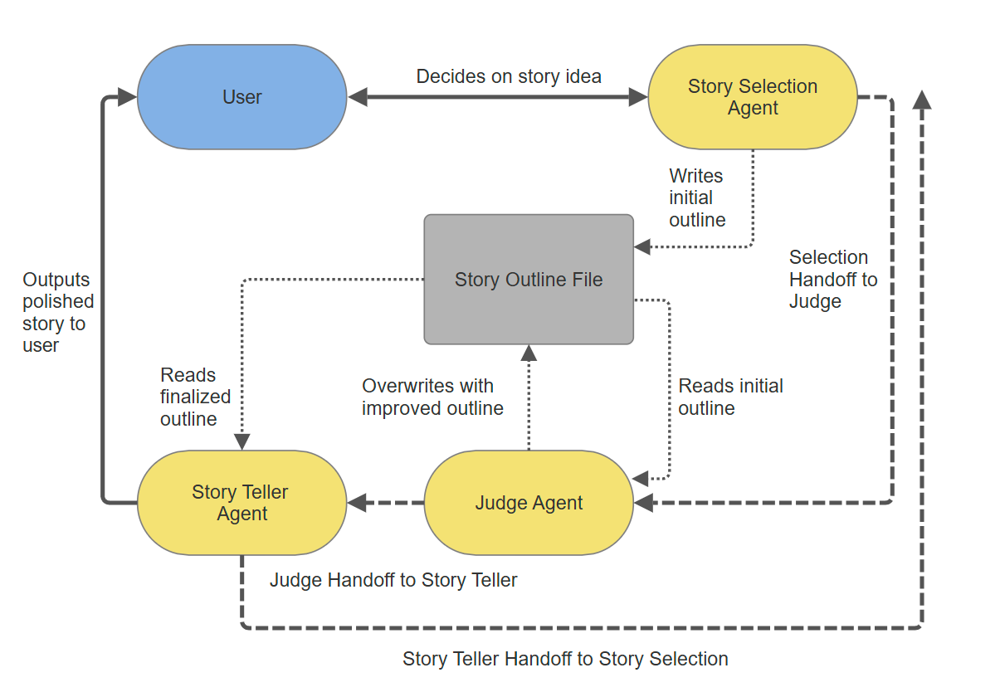

# Story Teller 🐘

An interactive AI-powered storytelling application featuring Boop Boop the Storytelling Elephant, designed to create and narrate engaging stories for children aged 5-10 years old. This is an interview project for Hippocratic AI.

## Overview

Story Teller is a multi-agent AI system that creates personalized, age-appropriate stories through an interactive conversation with children. The application uses a sophisticated orchestration of AI agents to generate, refine, and narrate stories that capture children's imagination while teaching valuable lessons. The default model for this project is gpt-3.5-turbo. The handoff and tool design is a little different than what I would have done for more capable models because 3.5 turbo is very dumb and needs lots of hand holding and reminders to not make mistakes. Tool usage and handoffs are still possible, but the scope of what can be done is more limited. You see MAJOR improvements just by swapping to 4.1 so I recommend doing so if that is at all possible.  

## Features

- **Interactive Story Creation**: Children can request specific story ideas or let Boop Boop suggest one
- **Multi-Agent System**: 
  - **Story Selection Agent**: Warmly interacts with children to understand their story preferences
  - **Secret Story Judge**: Works behind the scenes to enhance story outlines with rich details
  - **Story Telling Agent**: Brings stories to life with vivid narration and engaging language
- **Age-Appropriate Content**: Stories are carefully crafted for 5-10 year olds with simple yet rich language
- **Engaging Narration**: Uses sound effects, vivid descriptions, and pacing to keep children engaged
- **Educational Value**: Each story includes a moral or lesson naturally woven into the narrative

## Installation

1. Clone the repository:
```bash
git clone https://github.com/aidenament/story_teller.git
cd story_teller
```

2. Install dependencies:
```bash
pip install -r requirements.txt
```

3. Set up environment variables:
Create a `.env` file in the project root. Add your OpenAI API and Weights and Biases keys:
```
OPENAI_API_KEY=your_api_key_here
WANDB_API_KEY=your_api_key_here_again
```

## Usage

Run the application:
```bash
python main.py
```

The application will:
1. Introduce Boop Boop the Storytelling Elephant
2. Ask if you have a specific story idea or would like a suggestion
3. Create a story outline based on your preferences
4. Narrate the complete story with engaging details and pacing

To exit the application, type `quit`, `exit`, or `bye`.

## Project Structure

```
story_teller/
├── main.py                 # Main application entry point
├── config.py              # Configuration settings
├── requirements.txt       # Python dependencies
├── functions/            # File operation utilities
│   ├── get_file_content.py
│   ├── get_files_info.py
│   └── write_file_content.py
└── story/               # Story content directory
    └── outline.txt      # Generated story outlines
```

## How It Works



1. **Story Selection**: Boop Boop interacts with the child to understand their story preferences
2. **Outline Creation**: Based on the child's input, a detailed story outline is created
3. **Outline Enhancement**: The Secret Story Judge silently improves the outline with rich details
4. **Story Narration**: Boop Boop reads the enhanced outline and narrates a complete, engaging story
5. **Paced Delivery**: The story is delivered in paragraphs with natural pacing for better engagement

## Future Enhancements

As noted in the code comments, potential improvements include:
- Enhanced file system usage for character profiles, settings, and events
- Multi-part story narration for longer tales
- Specialized agents for targeted story element improvements
- Shared memory system for complex story development

## Requirements

- Python 3.7+
- OpenAI API key
- Weights and Biases API key (if using weave)
- Dependencies listed in `requirements.txt`
